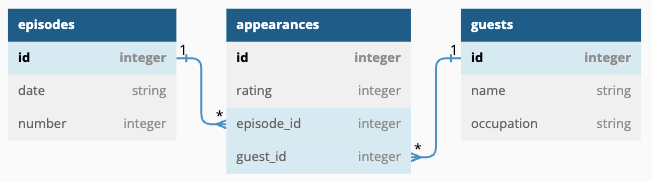
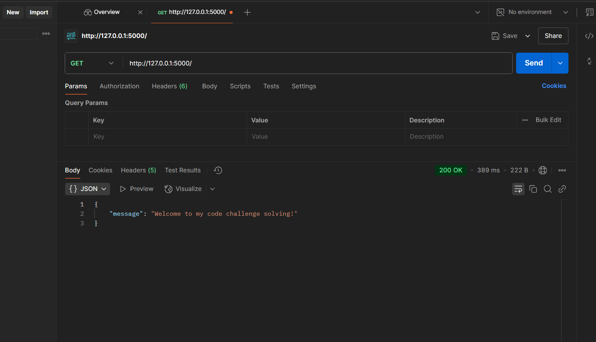
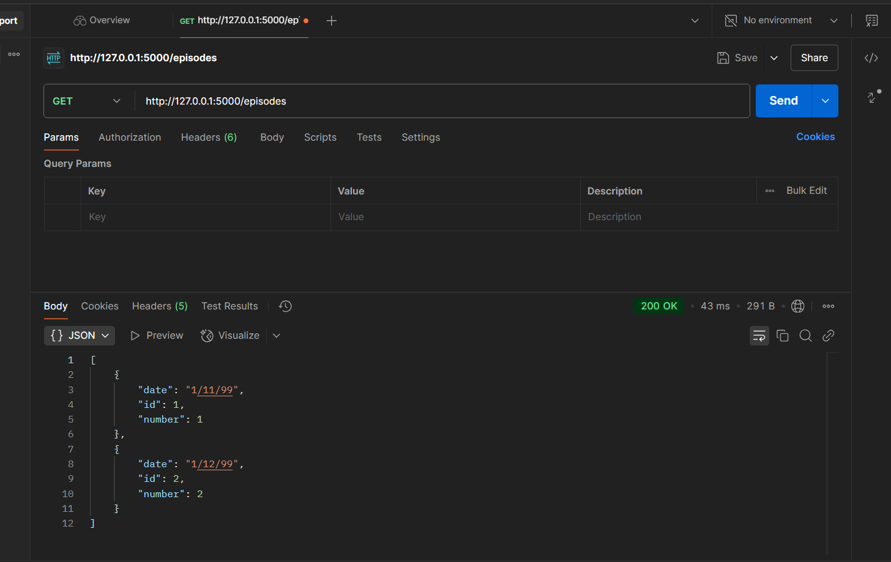
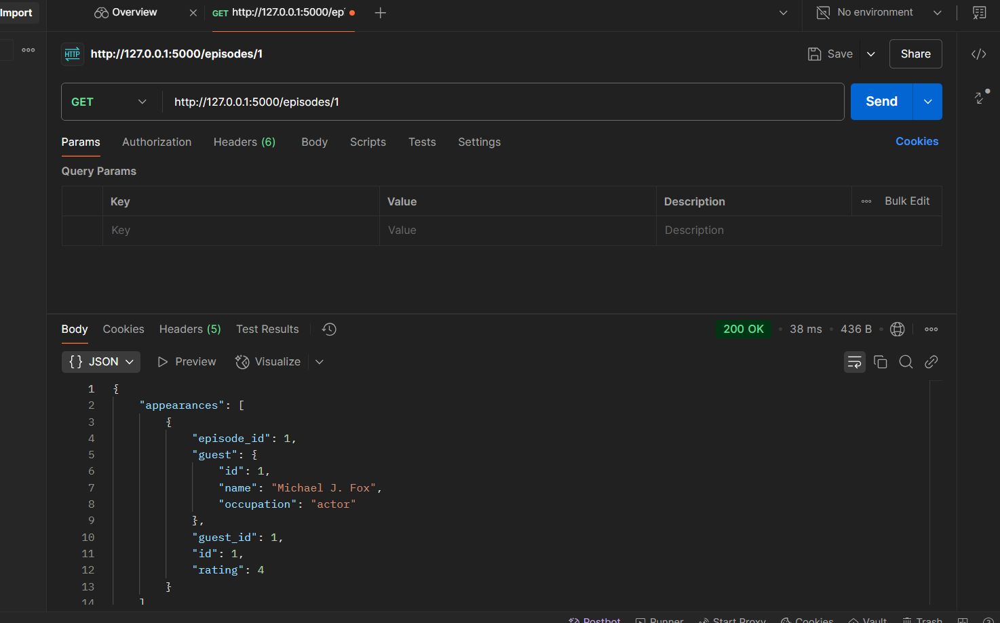
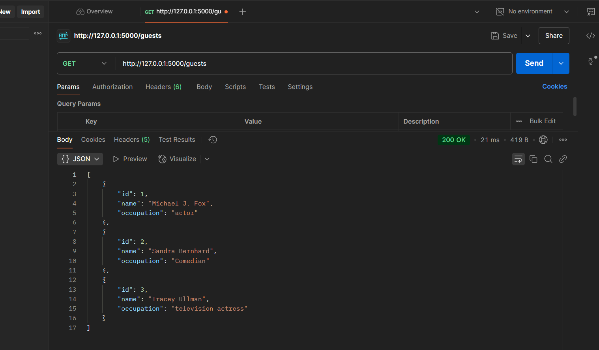
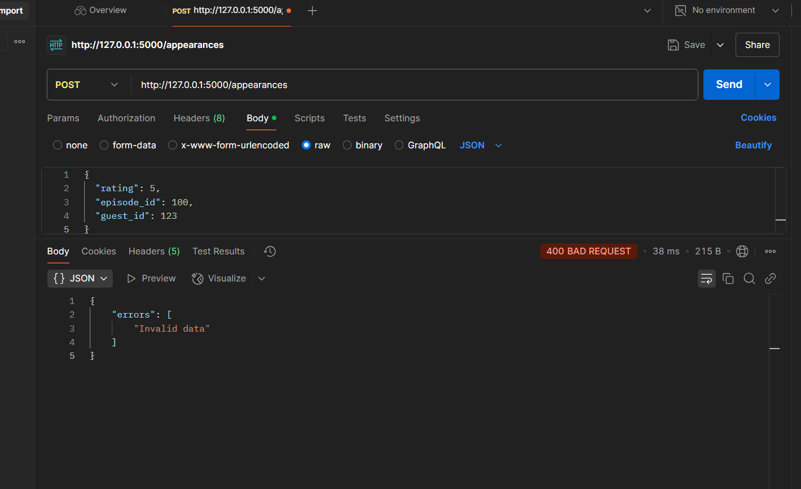
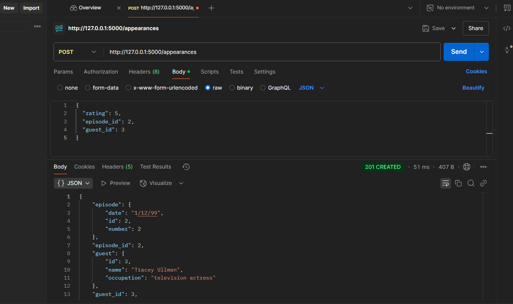

# Late-Show-code-challenge

### Deliverables
Your job is to build out the Flask API to add the functionality described in the deliverables below.

### Models
You will implement an API for the following data model:

Now you can implement the relationships as shown in the ER Diagram:

        - An `Episode` has many `Guest`s through `Appearance`
        - A `Guest` has many `Episode`s through `Appearance`
        - An `Appearance` belongs to a `Guest` and belongs to a `Episode`

Since a `Appearance` belongs to a `Episode` and a `Guest`, configure the model to cascade deletes.

Set serialization rules to limit the recursion depth.
Run the migrations and seed the database
Note that this seed file uses a CSV file Download CSV fileto populate the database. If you aren't able to get the provided seed file working, you are welcome to generate your own seed data to test the application.

### Validations
Add validations to the `Appearance` model:

- must have a `rating` between 1 and 5 (inclusive - 1 and 5 are okay)

### Routes

Set up the following routes. Make sure to return JSON data in the format specified along with the appropriate HTTP verb.

Recall you can specify fields to include or exclude when serializing a model instance to a dictionary using to_dict() (don't forget the comma if specifying a single field).
### Decided to add an index route

###  a. GET /episodes
Return JSON data in the format below:
        [
        {
            "id": 1,
            "date": "1/11/99",
            "number": 1
        },
        {
            "id": 2,
            "date": "1/12/99",
            "number": 2
        }
        ]

### b. GET /episodes/:id
If the `Episode` exists, return JSON data in the format below:
        {
        {
            "id": 1,
            "date": "1/11/99",
            "number": 1,
            "appearances": [
                {
                    "episode_id": 1,
                    "guest": {
                        "id": 1,
                        "name": "Michael J. Fox",
                        "occupation": "actor"
                    },
                    "guest_id": 1,
                    "id": 1,
                    "rating": 4
                }
            ]
        }
If the `Episode` does not exist, return the following JSON data, along with the appropriate HTTP status code:
        {
        "error": "Episode not found"
        }

### c. GET /guests
Return JSON data in the format below:
        [
        {
            "id": 1,
            "name": "Michael J. Fox",
            "occupation": "actor"
        },
        {
            "id": 2,
            "name": "Sandra Bernhard",
            "occupation": "Comedian"
        },
        {
            "id": 3,
            "name": "Tracey Ullman",
            "occupation": "television actress"
        }
        ]

### d. POST /appearances
This route should create a new `Appearance` that is associated with an existing `Episode` and `Guest`. It should accept an object with the following properties in the body of the request:
        {
        "rating": 5,
        "episode_id": 100,
        "guest_id": 123
        }
If the `Appearance` is created successfully, send back a response with the following data:
        {
        "id": 162,
        "rating": 5,
        "guest_id": 3,
        "episode_id": 2,
        "episode": {
            "date": "1/12/99",
            "id": 2,
            "number": 2
        },
        "guest": {
            "id": 3,
            "name": "Tracey Ullman",
            "occupation": "television actress"
        }
        }
If the `Appearance` is **not** created successfully, return the following JSON data, along with the appropriate HTTP status code:
        {
        "errors": ["validation errors"]
        }

after rectifying my appearance model and app code i ot the put put expected
